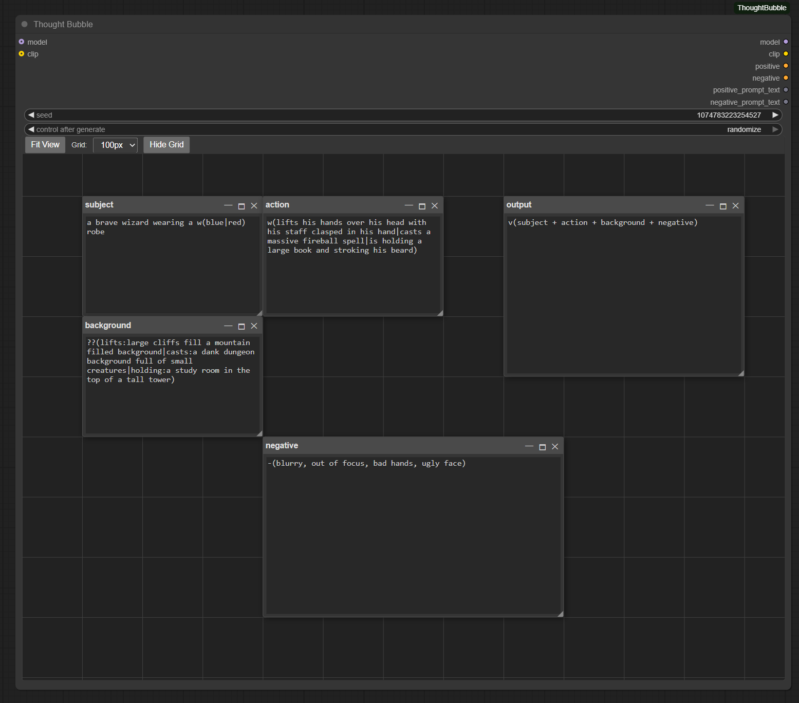

# **ThoughtBubble for ComfyUI**

ThoughtBubble is a custom node for ComfyUI that provides an interactive canvas to build and manage your prompts in a more visual and organized way. Think of it as a whiteboard for your ideas, allowing you to link different concepts, create conditional logic, and dynamically generate prompts using a powerful set of commands.

---

## **Features**

* **Visual Prompting**: Ditch the single text box. Create, move, and resize "thought bubbles" on an infinite canvas.
* **Dynamic Commands**: Use a simple yet powerful command syntax to reference other boxes, create negative prompts, use wildcards, and even implement conditional logic.
* **Custom Variables & Controls**: Create "Controls" boxes to define your own stateful variables. Set their behavior (increment, decrement, randomize, fixed value) and link them to commands for advanced sequential and conditional prompting.
* **Sequential Iteration**: step through lists sequentially across multiple generations using the run counter or a variable from a control box.
* **LoRA Autocomplete**: The editor will automatically suggest LoRA names as you type `lora(...)`.
* **Wildcard Support**: Integrates with a `user/wildcards` directory to pull random lines from your own text files.
* **Seedable Randomness**: The `seed` input on the node ensures that any random choices (from wildcards or random number generation) are repeatable.
* **Area Conditioning**: Create special "area" boxes to apply prompts to specific regions of your image, giving you fine-grained control over your composition.

---

The above example image uses a 2D array to loop through 9 possible prompts. Conditional commands are use to parse the selected prompt from the text array to further control the output.

## **Installation**

1.  Navigate to your `ComfyUI/custom_nodes/` directory.
2.  Clone this repository: `git clone https://github.com/matthewfriedrichs/ComfyUI-ThoughtBubble.git`
3.  Restart ComfyUI.

---

## **How to Use**

1.  Add the **ThoughtBubble** node to your workflow (it can be found in the "Workflow Efficiency" category).
2.  Note the **seed** and **iterator** widgets on the node. The main iterator is designed to change value on each run (e.g., increment), allowing you to use the `i()` command for sequential prompting.
3.  The node provides a large canvas widget. You can:
    * **Create a box**: Left-click and drag on an empty area of the canvas, or double-click to open a creation menu.
    * **Move a box**: Click and drag the header of any box.
    * **Resize a box**: Click and drag the bottom-right corner of any box.
    * **Pan the canvas**: Middle-click (or scroll-wheel click) and drag.
    * **Zoom**: Use the scroll wheel.
4.  By default, the content of the box titled "**output**" will be used to generate the final prompt. You can also maximize any other box to use its content as the source instead.
5.  **Use the Controls Box for Advanced Logic**:
    * Create a "Controls" box from the creation menu (double-click on the canvas).
    * Click "+ Add Variable" to create a new variable. Give it a unique name, set its behavior (e.g., "Increment"), and provide a starting value.
    * In any text box, type `i()` or `w()`. A dropdown menu will appear, allowing you to link the command to one of your custom variables. The variable's behavior will now control the output of that command on each generation.

---

## **Commands (The Core Feature)**

The power of ThoughtBubble comes from its command parser. You can type these commands into any text box to dynamically generate parts of your prompt.

### **`v(...)` - Variable/Box Operations**

This is the most fundamental command. It can be used to define variables or reference boxes and variables.

* **Define a variable**: `v(variable_name|variable text)`
* **Reference a box or variable**: `v(name)`
* **Combine boxes**: `v(box1 + box2)`

---

### **`-(text)` - Negative Prompt**

This command moves text from the positive prompt to the negative prompt.

* **Syntax**: `-(text to make negative)`
* **Example**: `beautiful painting -(ugly, deformed)`

---

### **`w(wildcard)` - Wildcard (Random)**

Selects a **random** line from either an inline list or a file in your `ComfyUI/user/wildcards` folder. By default, this is controlled by the main `seed` widget on the node.

* **Syntax (Inline List)**: `w(option1 | option2 | option3)`
* **Syntax (File)**: `w(filename_without_extension)`

**Linking Variables**: You can override the default random seed behavior by linking this command to a variable from a "Controls" box. Simply type `w(` and a dropdown will appear, listing all available variables. If you link a variable with "Randomize" behavior, a new random seed will be generated for this command on each run. You can also link variables with "Fixed", "Increment", or "Decrement" behavior to select items from the list by a specific index.

---

### **`i(wildcard)` - Iterator (Sequential)**

Selects an item from a list **sequentially**. By default, it uses the node's main `iterator` widget, which increments on each run. It loops back to the start automatically. This is perfect for "prompt traveling" or creating animations.

#### **1D Iteration (Simple Lists)**
* **Syntax (Inline List)**: `i(option1 | option2 | option3)`
* **Syntax (File)**: `i(filename_without_extension)`
* **Example**: With `i(cat|dog|bird)`, the output will be "cat" on the first run, "dog" on the second, "bird" on the third, and then loop back to "cat".

#### **N-Dimensional Iteration & Templating (Combinations)**
You can define multiple dimensions of lists to generate every possible combination. Each dimension can be a **simple list** `(a|b|c)` or a **template string** that mixes text with sub-lists `with (green|blue) fur`.

* **Syntax**: `i( (dim1_a|dim1_b) | a (red|blue) car | ...)`
* **Example**: `i( (a cat|a dog) | with (green|orange) fur )`
* **How it works**: The parser expands the template `with (green|orange) fur` into a full list `['with green fur', 'with orange fur']`. It then generates every combination:
    * **Iterator 0:** "a cat, with green fur"
    * **Iterator 1:** "a cat, with orange fur"
    * **Iterator 2:** "a dog, with green fur"
    * **Iterator 3:** "a dog, with orange fur"
    * **Iterator 4:** Loops back to the beginning.

**Linking Variables**: You can override the default iterator behavior by linking this command to a variable from a "Controls" box. Type `i(` and a dropdown will appear, listing all available variables. This allows you to have multiple, independent iterators in your prompt, each with its own state (e.g., one variable increments, another decrements, and a third stays fixed).

---

### **`r(min|max)` or `r(max)` - Random Number**

Generates a random integer or float within a specified range.

* **Syntax**: `r(max)` or `r(min|max)`
* **Example**: `A stack of r(10) books`

---

### **`lora(name:model_strength:clip_strength)` - Apply LoRA**

Loads a LoRA with a specific strength.

* **Syntax**: `lora(lora_name:strength)` or `lora(lora_name:model_strength:clip_strength)`

---

### **`a(box_title)` - Area Conditioning**

Applies the prompt from a special "area" box to a specific region of the generated image.

* **Syntax**: `a(title_of_area_box)`

---

### **`?(keywords|text_if_true|text_if_false)` - Conditional**

Checks if any of the given keywords appear in the already-processed part of the prompt.

* **Syntax**: `?(keyword1, keyword2 | text if found | text if not found)`

---

### **`??(keywords1:output1|keywords2:output2)` \- Multi-Conditional**

A more advanced conditional that allows for multiple checks.

* **Syntax**: `??(key1,key2:output_if_found | key3:another_output | ...)`

---

### **Advanced Commands**

* **`h(text)` \- Hidden Text**: The text inside `h()` is processed for commands but is hidden from the final output.
* **`f(text)` \- Force Resolution**: Forces the parser to re-evaluate the text inside, which is useful for complex nested commands.